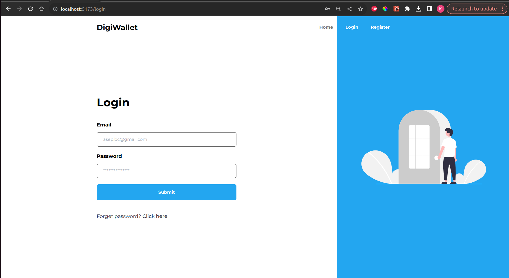
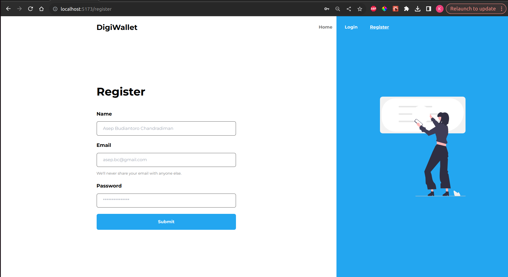
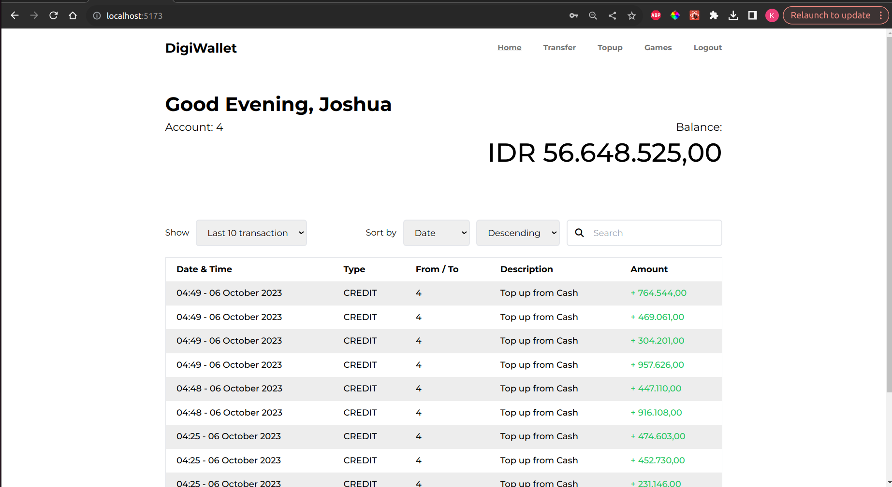
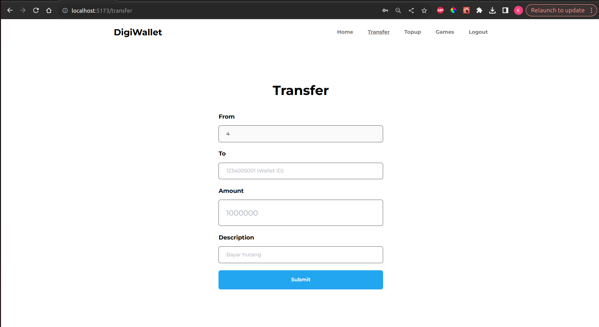
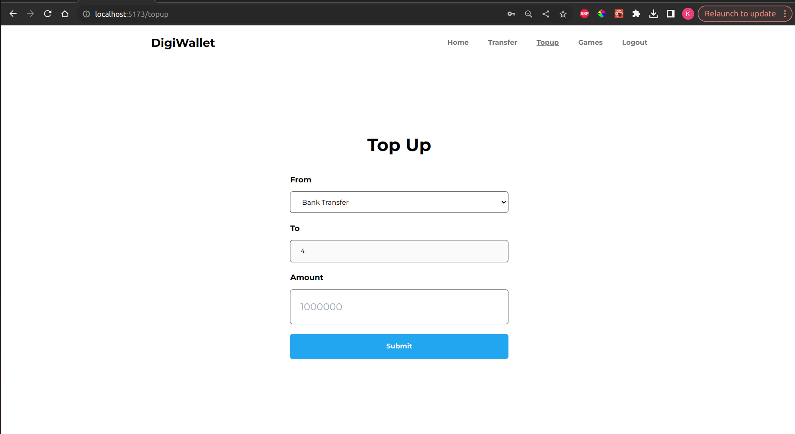
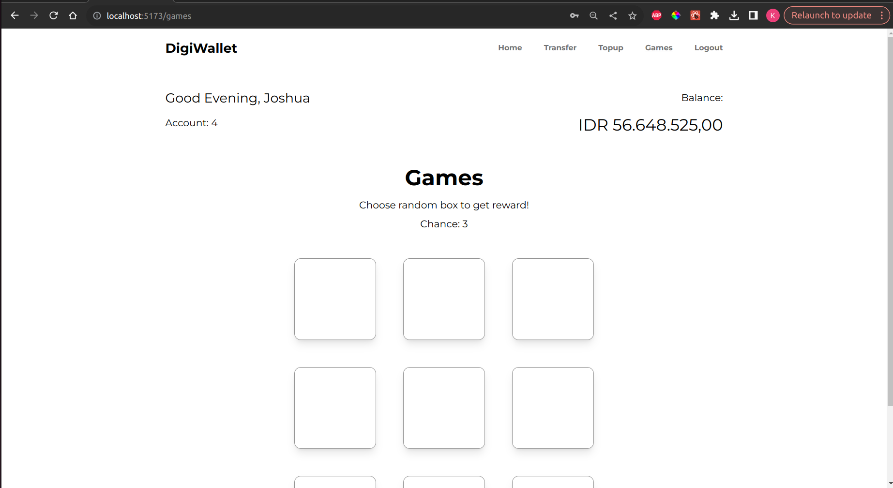
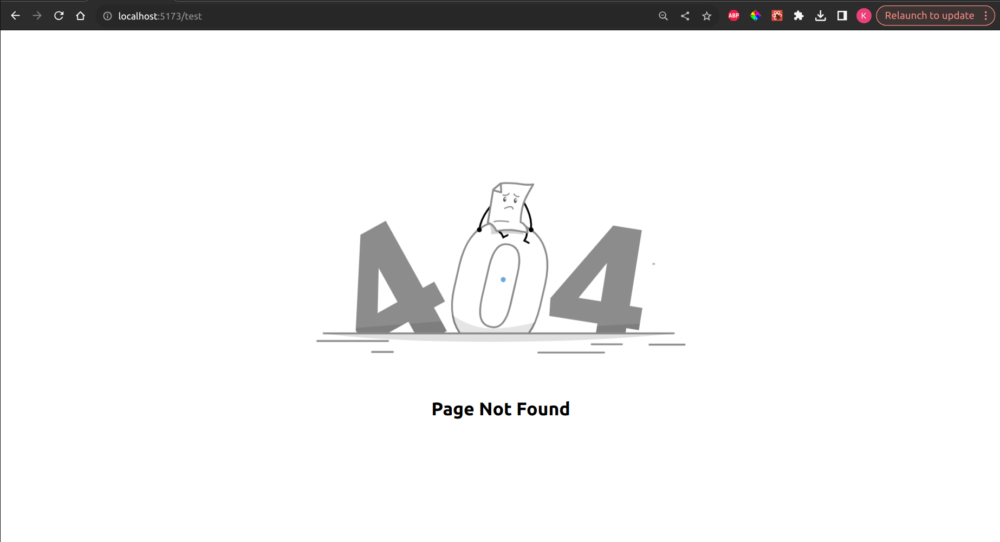
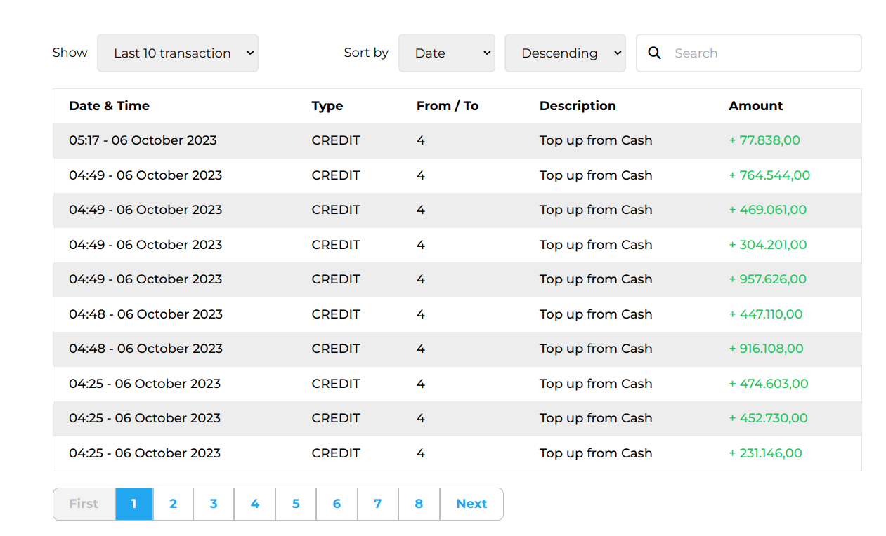

# Assignment React Starter

## Step to Run the Provided Backend :

1. Go to the backend folder

2. see the env file (.env)

3. create database and migrate based on the env file and file (setup.sql)

4. Run the \*-server. If you use linux, run linux-server. If you use mac, run mac-server

5. You may visit the API documentation by going to the http://localhost:8080/docs

## Note About Permission Issue:

If you encounter with permission issue when executing the server, you may run:

chmod +x linux-server

OR

chmod +x mac-server

## Step to Run the frontend project

1. Go to frontend-project folder

2. open terminal

3. run "pnpm install" for installing project dependencies

4. run "pnpm run dev" for starting the project -> then open http://localhost:5173/ in the browser

5. run "pnpm run test" for running Transfer page test

# Screenshot of the App

